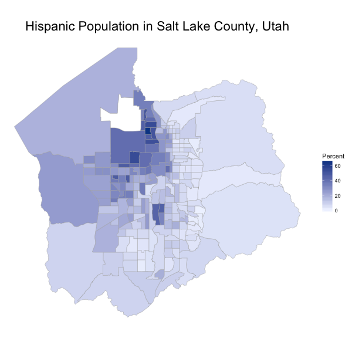

# choroplethrUTCensusTract
Shapefile, Metadata, and Visualization Functions for US Census Tracts in Utah

Based on Ari Lamstein's `choroplethrCaCensusTract` package

## Installation

To install the package type the following:

```
# install.packages("devtools")
library(devtools)
install_github("juliasilge/choroplethrUTCensusTract")
library(choroplethrUTCensusTract)
```

## An Example Choropleth Map


